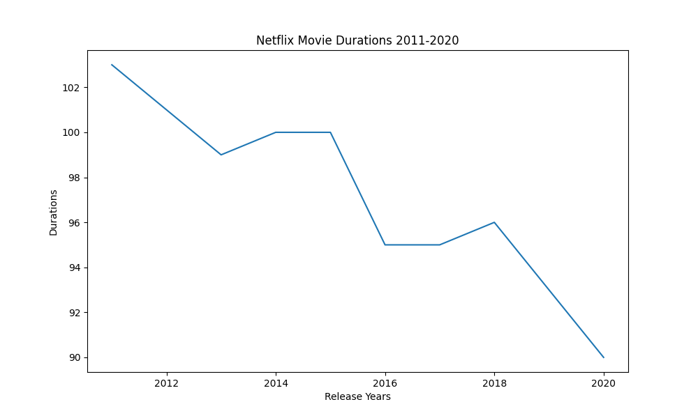

  <h1> mohamed </h1>
  
  
<p></p>
  <code>for x in range(5):
  print(x)</code>
  
  <p><p>
  
  
  
  
  
  
  
```python
# Import pandas under its usual alias
import pandas as pd

# Create a DataFrame from the dictionary
durations_df = pd.DataFrame(movie_dict)

# Print the DataFrame
print(durations_df.head)
```
```
  ldigjlgnikjdfklgn
  sdgolnidfgindfkgdfikg
  osdfhsdojnsjognlknsdf
  ```
 
